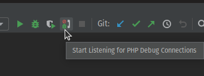

## Pantheon debugging with PhpStorm

Pantheon service uses XDebug module for backend debugging. The module is already included
into the container, though the IDE needs some setup before you start.

### Step 1: configure debugger

Port 9001 is used to reach external debug tool. Make sure you set it to proper value on 
Debug page. Check all the checkboxes here.

### Step 2: configure path mappings

Add new server on the Servers page, point its host to `localhost`. Port field can have 
any value. Make sure you check "Use path mappings" checkbox and fill the paths exactly as
shown on the screenshot. Note that inside container all services are located inside
`/var/www/html` folder. The folder itself should be pointed to the project root.

### Step 3: press the "Listen" button

Right here!

### Step 4.1: add a breakpoint in IDE

Before this you will need to append a certain parameter to the URL you're debugging:
`http://localhost:4002/profile?XDEBUG_SESSION=start` - notice the `?XDEBUG_SESSION=start` part.
Now you can use your IDE breakpoints functionality like shown on the screenshot below:

Please note that `?XDEBUG_SESSION=start` parameter is not transferred between services, e.g.,
setting the parameter for Rheda URL will not automatically pass it to Frey/Mimir. To debug
Frey/Mimir in this case, use step 4.2.

Tyr sets the `?XDEBUG_SESSION=start` parameter automatically in developer build for all
outgoing requests, so no additional configuration is required when debugging requests from Tyr.

### Step 4.2: add an explicit breakpoint in code

Use `xdebug_break();` instruction in the php code to trigger debugger session. This method
can be used in every case the previous one didn't work, as it doesn't require any external 
trigger.
